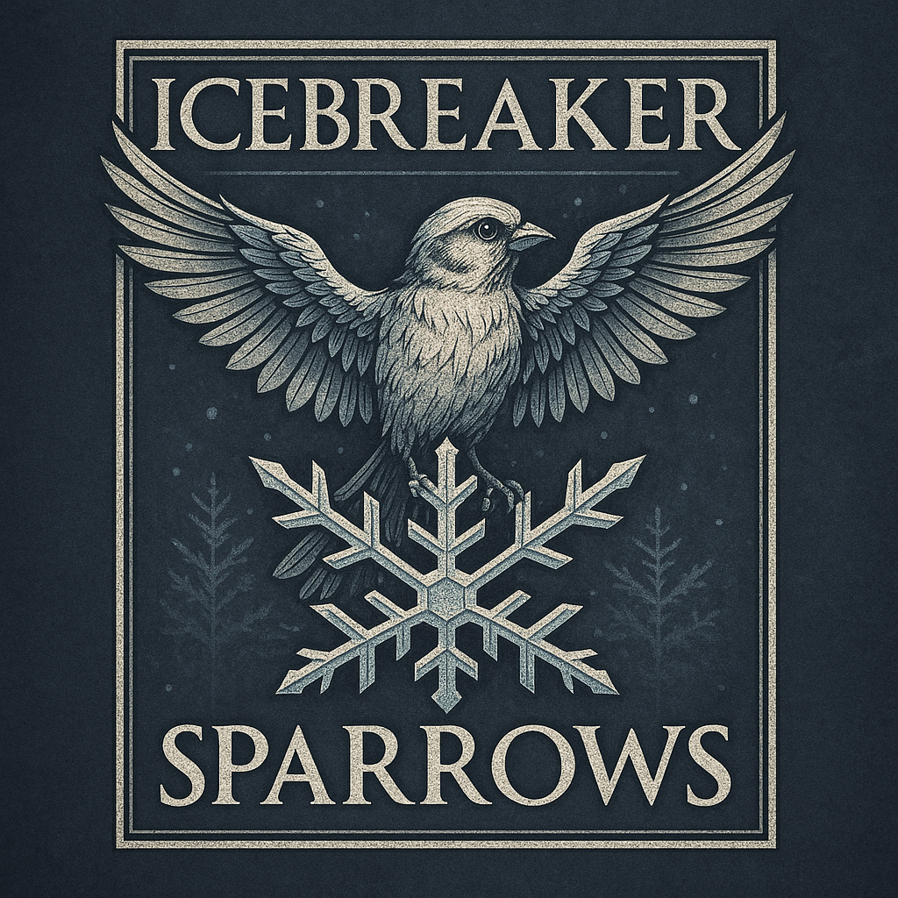
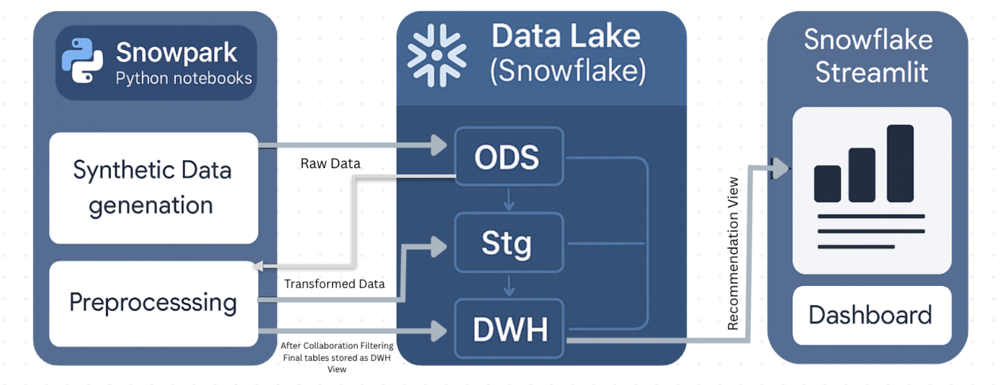

# 🧊 Icebreaker Sparrows – Snowflake Native Product Recommendation Application

  

## 🔍 Overview

This is an Data-driven product recommendation system built entirely using Snowflake Native App capabilities. This project simulates a real-world enterprise solution that predicts high-affinity product categories for dealers using collaborative filtering techniques — enabling cross-sell and upsell at scale.

💡 Built with **Snowpark Python**, **Snowflake Notebooks**, and **Streamlit in Snowflake**, the entire pipeline — from data generation to interactive dashboard — runs within the Snowflake ecosystem.

## Problem Statement & Solution Overview

### ❗ Problem:

Sales and supply teams often struggle with:

* Low visibility into dealer behavior
* Missed cross-sell or upsell opportunities
* High effort in manual product targeting
* Limited personalization at scale

### ✅ Solution:

**Icebreaker Sparrows** solves this by:

* Simulating realistic dealer-product interactions
* Using collaborative filtering to learn behavior patterns
* Predicting top-N product recommendations for each dealer
* Delivering results via an embedded, secure Streamlit dashboard within Snowflake

## 🌟 Key Features

* ⚙️ **End-to-End Pipeline** – All stages from data generation to dashboard within Snowflake
* 🧠 **Collaborative Filtering** – AI model built using Python & SQL to detect dealer similarity
* 🧰 **Snowpark Processing** – Efficient preprocessing and feature engineering with Snowflake compute
* 📊 **Native Dashboard** – Streamlit App deployed inside Snowflake for real-time business use
* ☁️ **Cloud-Native & Scalable** – Zero external compute, using Snowflake's elastic architecture

## 💼 Business Benefits

| 🚀 Benefit                 | 💡 Description                                                              |
| ---------------------------| --------------------------------------------------------------------------- |
| 📈 **Boosts Sales**        | Recommends untapped product categories to dealers, increasing order volumes |
| ⏱️ **Saves Time**          | Replaces manual analysis with instant, AI-generated insights                |
| 🧠 **Improves Targeting**  | Personalized recommendations increase dealer satisfaction and loyalty       |
| 🔁 **Upsell & Cross-sell** | Identifies buying patterns to suggest complementary products                |
| 🧩 **Easy Integration**    | Native to Snowflake — fits directly into existing data infrastructure       |

## 📁 Project Structure

| File                                        | Description                                                                                                      |
| ------------------------------------------- | ---------------------------------------------------------------------------------------------------------------- |
| `01_initialize_snowflake_environment.ipynb` | Creates roles, warehouses, databases, and schemas (ODS, STG, DWH) inside Snowflake.                              |
| `02_Synthetic Data Generation.ipynb`        | Generates synthetic data for dealers, products, and historical sales using Snowpark.                             |
| `03_Preprocessing.ipynb`                    | Prepares interaction matrices, encodes user-product pairs, and computes collaborative filtering recommendations. |
| `04_streamlit_app.py`                       | Streamlit Native App that displays top-N product recommendations dealer-wise using Snowflake views.              |
| `Icebreaker_sparrows_logo.png`              | Project branding image used in the dashboard and presentation.                                                   |
| `IcebreakerSparrows_FinalSubmission.pptx`   | Final project presentation summarizing architecture, implementation, demo, and business value.                   |

## 🧠 Solution Highlights

* **Synthetic Data Simulation**: Realistic purchase behavior emulated using Python in Snowpark.
* **Collaborative Filtering**: Identifies patterns in product purchases across similar dealers.
* **Snowflake-Only Implementation**: Entire pipeline runs within Snowflake — no external servers or data transfer.
* **Native Dashboard**: Deployed using **Streamlit in Snowflake** for secure and fast visualization.

## 🏗️ Architecture

  

## 🖥️ Demo

📸 *Screenshots included in:* `IcebreakerSparrows_FinalSubmission.pptx`  
🎥 *Demo video link:* [https://shorturl.at/WxI19](https://drive.google.com/file/d/13AgsQ-qjwYkiX-y9FnoxPEsC5DMHIxqb/view?usp=drive_link) 

## 📊 Key Features Used in Snowflake

* **Snowpark Python** for data generation and preprocessing
* **Temporary Tables** for efficient in-memory filtering
* **Views** like `DWH.RECOMMENDATION_DASHBOARD` for clean dashboard access
* **Streamlit** Native App for interactive UI without leaving Snowflake
* **Scalable Architecture** using Snowflake’s elastic compute and storage

## 🚀 Future Enhancements

* Replace synthetic data with real dealer/product transactions
* Add clustering for dealer segmentation
* Integrate demand forecasting and other ML models in Cortex
* Enhance dashboard UI/UX with charts and export capabilities

## 🐦 What's in the Name: *Icebreaker Sparrows*

The name **Icebreaker Sparrows** reflects the **essence and impact** of this project:

- **Icebreaker**: Like a ship breaking through frozen barriers, the solution cuts through data silos and decision inertia — clearing the path for data-driven, intelligent product targeting.
- **Sparrows**: Small, adaptive, and incredibly fast — they symbolize the **agility, scalability, and simplicity** of this native app, which delivers quick and actionable insights within the Snowflake environment.

Together, **Icebreaker Sparrows** represents a **smart, efficient, and transformative data application** that enables businesses to break through complexity and unlock growth through precise recommendations.

## 💡 Quote to Remember

> *"Without data, you're just another person with an opinion."*  
> — **W. Edwards Deming**
